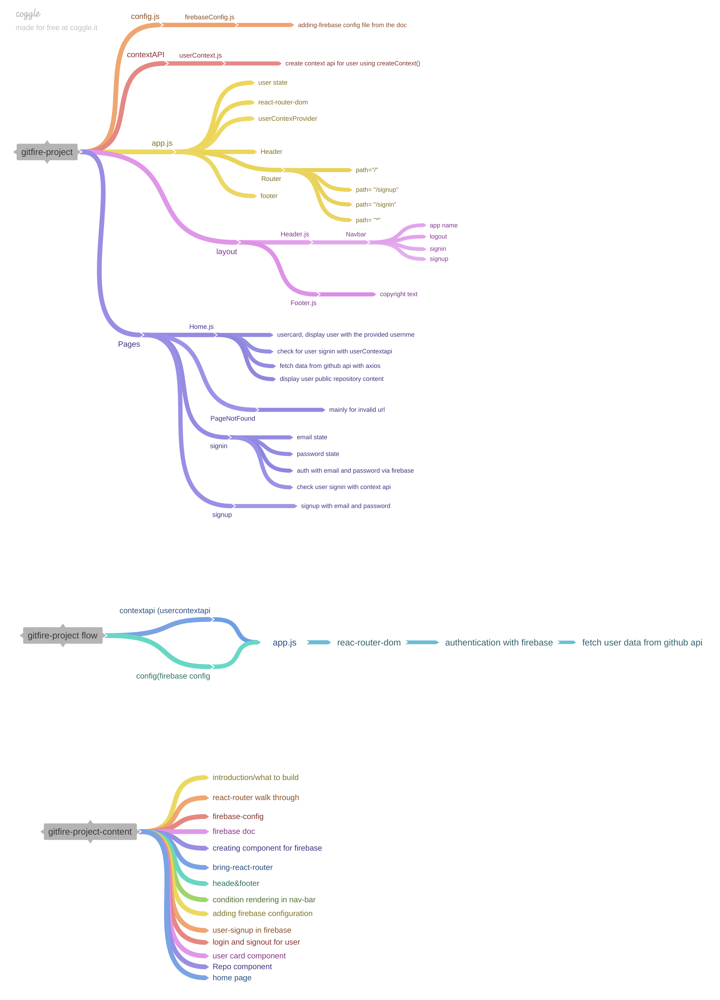

# simple gitfire project to fetch user data provided by github with firebase authentication
- use context api for user data storage
- use firebase auth for authentication of user with email and password
- use react-router-dom for routing https request

# project mind map
